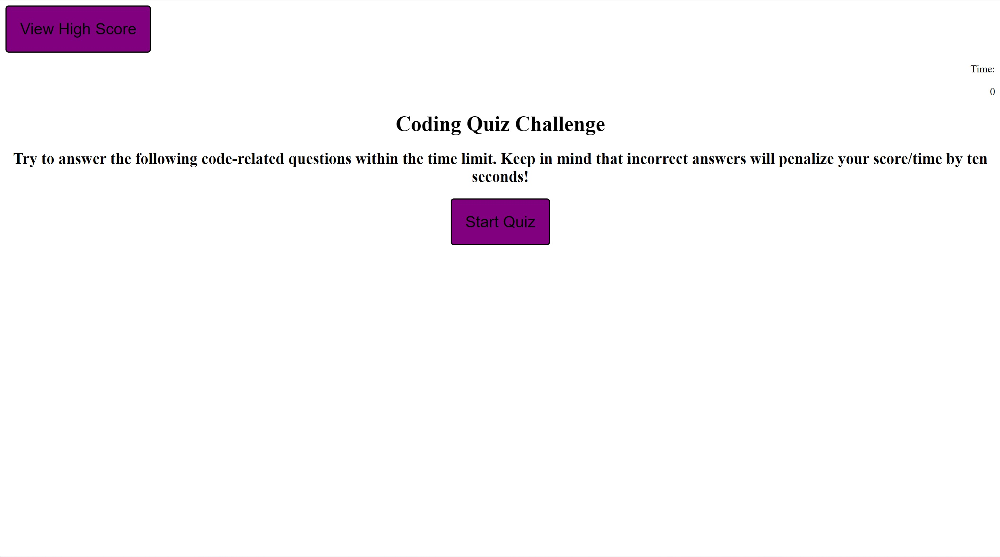

# Code-Quiz

## Description

As someone who enjoys the mix of education and entertainment, I created a project which quizzes the user with coding questions. While continuous practice is necessary for mastering coding, it should not stop anyone from treating it as fun as it can be and a quiz helps with treating this as a category from a quiz game.

## Table of Contents (Optional)

If your README is long, add a table of contents to make it easy for users to find what they need.

- [Installation](#installation)
- [Usage](#usage)
- [License](#license)

## Installation

What are the steps required to install your project? Provide a step-by-step description of how to get the development environment running.

## Usage

[Link to website](https://francislao9.github.io/Code-Quiz/)

## License

MIT License

## Features

If your project has a lot of features, list them here.
- An array of basic questions for javascript coding
- using localStorage to save information within page (using the same browser)

## Tests
- adapt to mobile sizes
- Expand range of questions that could be asked
- Expand range of types of questions that could be asked